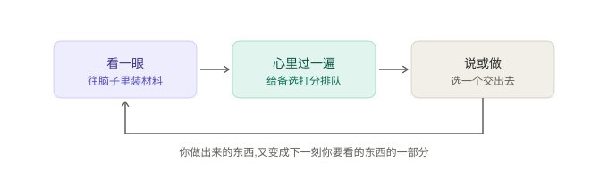
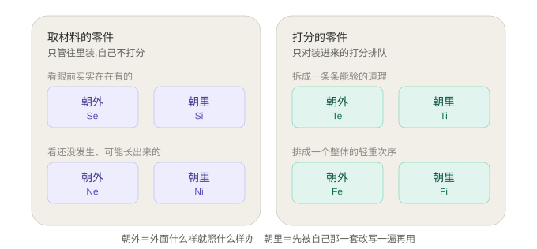
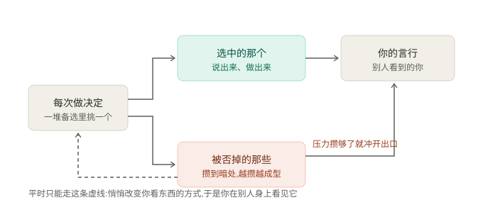
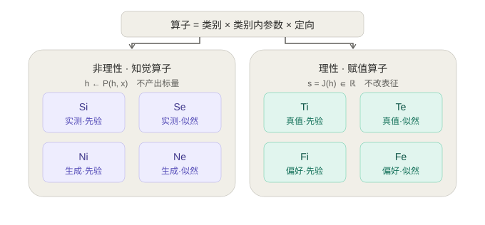
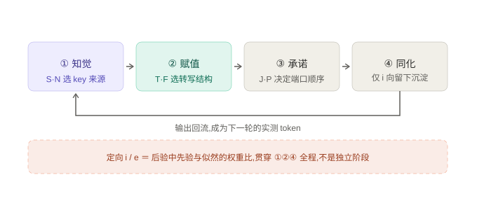
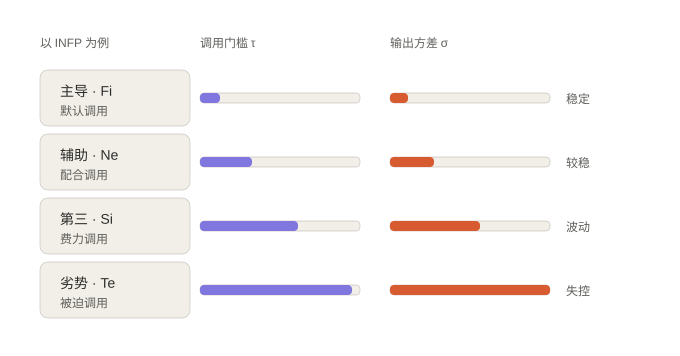
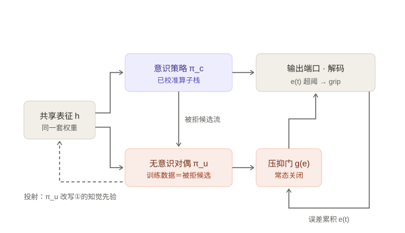
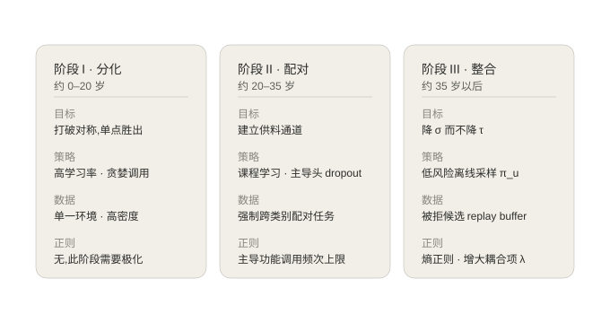

# Cognitive Functions as Inference Operators

## 荣格八维的自回归推理架构

**Zhuoyuan Mao**

> 一个把荣格心理类型论重写成自回归语言模型推理过程的解释性框架。
> 类型不是静态标签,而是推理过程本身的参数配置。
> 包含八个算子的形式定义、四阶段推理流水线、J/P 的机制位置、功能栈的动力学、
> 无意识的对偶策略实现,以及类型分化的训练方案。

---

## 0. 不用术语的版本

这一节不出现任何公式和术语,单独读也是完整的。

### 一台边看边说的机器

**把一个人想象成一台"边看边说"的机器。** 它每一刻都在做同一件事:看一眼周围,心里过一遍,然后说出或做出一点什么。



注意最下面那条回头的线:**它说出来的东西,又变成它下一刻要看的东西的一部分。** 这个循环就是它的全部,后面所有内容都是在说这个循环里的零件怎么装。

### 八个零件

这台机器身上有两类零件,干的活性质完全不同。

**第一类是"取材料"的零件。** 它们决定这一刻脑子里装的是什么,本身不作评价,只管往里装。取法有两种:取**已经发生的**——眼前实实在在有的;取**还没发生的**——从眼前这些东西里可能长出来的各种走向。前者是"感觉",后者是"直觉"。

**第二类是"打分"的零件。** 它们不往里装东西,只对已经装进去的打分,决定接下来说哪句、做哪件。打法也有两种:一种是把东西翻译成**能拆开验证的道理**——这句对不对、那个前提成不成立,拆开之后谁都能复核;另一种是把东西翻译成**一个整体的轻重次序**——这个比那个要紧,但你没法把这个次序拆成几条独立的道理交给别人复核。前者是"思维",后者是"情感"。

> 这里的"情感"**不是情绪**。它跟"思维"一样是在冷静地打分,只是打出来的是一个排序而不是一个真假。这是全篇最容易误解的一处。

**这两类零件各自还有朝外、朝里两个版本。** 朝外的以外面给的为准,外面什么样就照什么样办;朝里的以自己积累下来的那一套为准,外面给的会先被自己这套改写一遍再拿去用。



四种零件 × 两个版本 = 八个,这就是所谓的"八维"。顺带说一句:朝里的版本产出的东西**总是变了形的**,这不是它的缺陷,这就是它的定义。

### 三件真正想说的事

**第一,这八个零件不是并列的,调用成本差得很远。** 你从小反复用的那个,用得越多越准,越准越愿意用,于是越用越多——这是个自我加速的过程,几年之内就把差距拉开了。反过来,那个你从来不用的,不是因为你没有它,而是因为**它从来没被校准过**:一旦被逼着用,它给出的东西又极端又不靠谱。这就是为什么人在压力下会做出连自己都认不出来的事。

**第二,那些用不上的零件不是闲着,它们在暗处攒着。**



你每次做决定,都会否掉一堆备选。这些被否掉的东西并没有消失,它们恰好构成了那些"不用的零件"的学习材料。**所以你越是坚定地只走一条路,暗处那套东西就被喂得越饱、越成型、也越跟你意识里的态度相反。**

它平时出不来,因为出口被你的意识占着。但它有另一条路——图里那条虚线——它能悄悄改变你**看东西的方式**,让你在别人身上看到其实属于你自己的东西。这就是"投射"。而当压力累积到某个点,出口被直接冲开,那套从没校准过的东西接管了输出,这就是失控。

**第三,能改变这一切的不是"想通",而是训练安排。** 那个"越用越顺"的自我加速过程发生在成长期;要在成年后改变它,必须换一套训练方案:限制主导零件的调用频率,给次要的腾出空间;在**不担责的低风险场合**故意练那个最生疏的零件;把过去被否掉的方案重新拿出来正面处理一遍。目标不是让最生疏的零件变成主力——那做不到也不必要——而是**让它在被迫上场时不再失控**。

以上就是全部框架。后面的章节把这三件事写成了可以在语言模型上实际实现和检验的形式。

---

## 1. 三条公理

整套架构建立在三个映射上。每一条都把荣格的一个区分翻译成自回归推理里的一个具体机制。

| 荣格的区分 | 形式化 | 自回归推理中的实现 |
|---|---|---|
| 理性 / 非理性 | **类型签名不同** | 知觉算子 `h ← P(h, x)`,状态到状态,不产出标量;赋值算子 `s = J(h) ∈ ℝ`,产出标量、不改表征 |
| 感觉 / 直觉 | **key 取自哪个分布** | S 的 key 来自实测分布(已观测的 token);N 的 key 来自生成分布(从潜空间采出的未观测 token) |
| 思维 / 情感 | **转写的目标结构** | T 转写为真值图(命题、可分解、可外部复核);F 转写为偏好序(整体排序、不可分解、需承诺) |
| 内倾 / 外倾 | **后验中的权重比** | i 的后验由先验主导;e 的后验由似然主导 |

第一条是整个架构的承重墙。荣格反复强调思维和**情感都是理性功能**,感觉和直觉都是非理性功能;把这一点做成类型签名的差异,意味着知觉算子在结构上无法评价,赋值算子在结构上无法接收新材料。两者必须配对使用——**功能栈的存在不是约定,是类型系统的后果**。

第四条替换了一个常见的粗糙映射("内倾 = self-attention,外倾 = cross-attention")。粗糙映射说不清为什么内倾功能的产物总是主观化的。贝叶斯版本能说清:荣格说内倾者在客体与反应之间插入了主观因素,对应的就是后验被先验拉走。

**本体的边界**:本体 = 权重 + 自己生成并回流进上下文的 token 与 KV。本体之外 = 环境在这一步新注入的 token。自回归模型把自己的输出重新喂回输入,这是"内倾"在机制上成立的基础。

---

## 2. 八个算子



| 算子 | 类型签名 | 定义 |
|---|---|---|
| **Se** | `h ←` 实测 / 似然主导 | 客体 token 以最大保真写入表征,先验权重压到最低,温度趋零。看到什么就是什么 |
| **Si** | `h ←` 实测 / 先验主导 | 当下观测与本体既有的同类先验做贝叶斯融合。**产出的不是原貌,是被主观化的意象**——内倾感觉从不保存原始副本 |
| **Ne** | `h ←` 生成 / 似然主导 | 以客体为条件从生成分布采样未实现的分支;温度高、分支多、不塌缩 |
| **Ni** | `h ←` 生成 / 先验主导 | 从本体潜空间采样未实现分支,先验强到让分支迅速塌缩成一两条,表现为单点意象 |
| **Te** | `s =` 真值 / 似然主导 | 候选转写为命题,拿外部既定事实与规则验;判据可以交出去让别人复核 |
| **Ti** | `s =` 真值 / 先验主导 | 候选转写为命题,拿本体自建的公理集验;判据只在自己这套系统内成立 |
| **Fe** | `s =` 偏好 / 似然主导 | 候选转写为偏好序,序取自外场共有的价值排列 |
| **Fi** | `s =` 偏好 / 先验主导 | 候选转写为偏好序,序是本体私有的。**它同样做转写**,只是转出来的是不可分解的序关系 |

两点需要特别指出,因为它们是常见误解:

- **Fi 不处理"原始感受"。** 如果让 Fi 的 key 是未经转写的原貌 token,它就和 Se 共用了输入,退化成了感官。F 之所以是理性功能,正因为它做了赋值这一步转写;只是转写的目标结构是序关系而非命题。
- **窗口长度不是 S/N 的定义。** 长上下文的流水账窗口很宽,但完全不 N。N 之所以顺带表现为长程,是因为可能性要跨越更长的因果链;窗口长度是伴随现象,主参数是采样分布与温度。

---

## 3. 推理流水线:四个阶段



**① 知觉**(prefill,构造表征)。S/N 决定 key 从哪个分布取,i/e 决定先验权重。四个知觉算子在这里抢占同一份上下文预算——这是"感知功能互斥"的工程原因。

**② 赋值**(logit 重排)。T/F 决定转写成什么结构,i/e 决定判据从哪来。四个赋值算子输出都是标量,可加权求和——所以判断功能之间不互斥,而像多目标加权。

一处修正:**知觉算子交给赋值算子的不是一个个独立候选,而是一个比较集。** 尤其是 Ne——它的分支是成组产生的,单条分支脱离同胞就没有意义,显著性来自组内相对位置而非绝对尺度。这与 GRPO 用组内相对基线替代 value network 是同一个结构(见 6.4)。

**③ 承诺**(采样解码)。J/P 在这里生效,见第 4 节。

**④ 同化**(写回)。这一步存在一个不对称:先验权重高的算子(i 向)修改的是长期先验,似然权重高的算子(e 向)只修改当轮上下文。所以外倾功能不产生沉淀——不是它不写,是它写的东西在下一轮就被新观测冲掉了。

**定向 i/e 不是一个阶段。** 它是贯穿 ①②④ 的调制参数。把它当成第三、第四阶段是错的。

---

## 4. J/P 的机制位置

J/P 不改变任何算子的定义。它只决定一件事:**②赋值 相对于 ③承诺 的先后顺序**,等价地说——四个外倾算子中,哪一个占据对外端口。

| | J | P |
|---|---|---|
| 占端口的 | 赋值算子(Te / Fe) | 知觉算子(Se / Ne) |
| 解码范式 | **constrained decoding**:外部判据先生成 logit mask,再采样 | **speculative decoding**:先并行猜出草稿,再由内倾赋值算子逐个 accept / reject |
| 分支因子 | 低,早承诺 | 高,晚承诺 |
| EOS 阈值 | 低,快速收敛 | 高,持续开放 |

对内倾型人格,占端口的是**辅助**功能而非主导功能。INFP 主导 Fi、端口是 Ne,故为 P;INTJ 主导 Ni、端口是 Te,故为 J。这解释了为什么 J/P 在旁观者眼里最容易判断,在自己身上最难判断——它标记的是暴露在外的那个,不是你主要在用的那个。

---

## 5. 功能栈:τ 与 σ



给每个算子 $k$ 两个状态量:调用门槛 $\tau_k$ 与输出方差 $\sigma_k$。

$$p_k \propto \exp(-\tau_k / T) \qquad \sigma_k \propto N_k^{-1/2}$$

其中 $N_k$ 是该算子的累计有效调用次数。 $\tau$ 与 $\sigma$ 同步上升不是巧合:调用频次决定校准数据量,校准数据量决定输出方差。**主导功能就是被反复调用因而被反复校准的算子;劣势功能就是几乎从未被调用因而从未被校准的同一套机制。**

由此直接推出两条荣格的核心命题:

**补偿律(辅助功能的配对规则)。** 辅助功能必须与主导功能**类别相反且定向相反**。若主导是先验主导的赋值算子(如 Fi),系统就没有任何东西在接收新材料,会封闭在自己的偏好序里;必须有一个似然主导的知觉算子(Ne 或 Se)供料。这是类型系统的后果,不是约定。

**Grip(劣势功能的反扑)。** 劣势功能被外部压力强行触发时,产出的是高方差样本;又因为它属于与主导相反的类别,该类别的赋值算子此刻正好不在岗,没有东西给它剪枝。**Grip = 未校准算子的无剪枝解码。**

---

## 6. 无意识:在被拒候选流上训练的对偶策略

第 5 节只把非主导功能建模成"用得少的算子"。这不够——荣格的无意识是**自主的、并且与意识态度对抗的**。下面在自回归框架内给出一个真正对抗的实现。



### 6.1 结构

共享 trunk 上挂两个策略头:

- **意识策略 $\pi_c$**:已校准的算子栈,占据输出端口。
- **无意识对偶 $\pi_u$**: $\pi_c$ 的补集栈——类别相反、定向相反。它每一步都在算 logits,但被压抑门阻断。

对偶约束把两者的定向权重绑在一起:

$$w_u = 1 - w_c$$

所以**意识态度越极端,无意识的反向就越极端**。荣格说"越片面的意识态度,无意识的补偿越激烈",在这里是一个代数恒等式。

### 6.2 压抑门

$$g(t) = \sigma\big(\beta\,(e(t) - e^\ast)\big), \qquad e(t+1) = \gamma\,e(t) + \ell_t$$

$e(t)$ 是未消解的预测误差累积: $\pi_c$ 的解码持续产生高损失(目标不可达、外部反馈与内部判据长期冲突)时 $e$ 上升。 $e$ 越过阈值 $e^\ast$,门打开, $\pi_u$ 的 logits 突然主导。这就是 grip 的触发条件——它是**能量积累的结果,不是随机故障**。

### 6.3 关键机制: $\pi_u$ 的训练数据

$\pi_u$ 的自主性来自它有**独立的 credit assignment 通道**:它不从 $\pi_c$ 的梯度里学,它从 $\pi_c$ **拒绝掉的候选**里学。

$$\mathcal{D}_u = \{\,x : x \in \text{candidates}_t,\ x \notin \text{committed}_t\,\}$$

**被压抑的内容 = 被剪枝的候选 = 无意识的训练数据。** 这一条把四件互不相干的现象收束成同一个机制:

| 现象 | 机制 |
|---|---|
| 压抑 | 常态 $g \approx 0$, $\pi_u$ 无法占用输出端口 |
| 攒劲 | $\mathcal{D}_u$ 随每一次决断持续增长, $\pi_u$ 越练越成型 |
| 投射 | $\pi_u$ 出不了输出端口,但能改写 ①知觉 的先验;于是它的内容以"外部客体的属性"形式回流进上下文 |
| 梦 / 幻想 | 无外部 token 注入时(离线), $e^\ast$ 局部降低, $\pi_u$ 在纯生成分布上解码而不触发行为 |
| Grip | $e(t) > e^\ast$,门开,未校准策略直接接管输出 |
| 整合 | 把 $\mathcal{D}_u$ 从暗流变成显式 replay buffer(见第 7 节) |

投射那一条尤其值得强调:它解释了为什么被压抑的东西**总是以别人的属性出现**。 $\pi_u$ 唯一能改写的是知觉先验,而知觉先验决定的是"客体看起来是什么样"。

### 6.4 与 GRPO 的对应

GRPO 不是 Ne 的对应物,而是一个完整的 **Ne–赋值 环**,并且位于训练尺度而非推理尺度。group rollout 对应 Ne,reward 对应赋值算子,policy update 对应 ④同化。哪个赋值算子取决于奖励来源:可验证奖励(答案检查器、单元测试)是 Te,偏好模型是 Fe,自洽检查是 Ti。

三处对应值得记下:

- **组内相对基线 ↔ Ne 的比较集性质。** GRPO 没有 value network,一条分支的优势只相对于同胞计算。这正是 6.3 节说的:Ne 的产出是成组的,不是逐条的。
- **KL 系数是一个 Ni/Ne 旋钮。** rollout 采自模型自身策略(来源上属先验侧),但刻意维持高熵拒绝塌缩(发散侧)。两个力由两个超参分管:KL 惩罚把分布拉回参考策略(先验锚定,Ni),温度与组规模维持发散(Ne)。
- **熵坍缩 = Ne 退化成 Ni。** GRPO 训练中熵持续下降、组内多样性归零、优势信号消失,是已知失效模式;而常用修法(熵奖励、clip-higher、多样性奖励)恰好是第 7.2 节阶段 II 的处方:限制主导、强制多样。

两处不对应:GRPO 的分支是走完的 rollout、终局才打分,而 Ne 的分支是对当下情境的替代读法;GRPO 更新完即丢弃样本,而 Ne 的产出本身就是表征。所以推理尺度的 Ne 更接近 beam / tree expansion。

**最有用的一点。** GRPO 每一步都已经在生成被拒候选流了——组内低优势样本就是 $\mathcal{D}_u$。现行做法是给它们负梯度然后丢弃。按第 6.3 与 7.2 节,整合方案在 GRPO 上是一个低成本改动:保留低优势样本,单独训练 $\pi_u$ 头,加入耦合项 $\lambda$。这构成第 8 节的第 7 条预测。

---

## 7. τ 的训练时间尺度展开

推理时权重冻结, $\tau$ 不变——所以第 5 节只是一个横截面。类型的分化与整合发生在训练尺度上。

### 7.1 动力学

$$\tau_k(t+1) = \tau_k(t) - \eta\,a_k(t)\,q_k(t) + \delta$$

$a_k$ 是本轮是否被调用, $q_k$ 是反馈质量, $\delta$ 是遗忘衰减。结合 $p_k \propto \exp(-\tau_k/T)$,这是一个**富者愈富**的动力学:低 $\tau$ → 高频调用 → 更多校准 → 更低 $\tau$。

**类型分化 = 这个正反馈的锁定。** 定义分化度为 $\tau$ 谱的基尼系数 $G(t)$; $G$ 从接近 0 单调上升并在成长期末锁定,这就是"人有类型"的全部含义。

### 7.2 三阶段训练方案



**阶段 I — 分化(约 0–20 岁)。** 目标是打破对称。策略:高学习率、贪婪调用、单一奖励源。数据:来自单一环境(家庭、学校)的高密度低多样性反馈。正则:**不加**——这一阶段需要极化,过早的多样性正则会阻止主导功能形成。ML 上对应 winner-take-all 动力学。

**阶段 II — 配对(约 20–35 岁)。** 目标是建立供料通道,让辅助与第三功能可用。策略:课程学习,按 $\tau$ 升序解锁;关键是对**主导功能头做 dropout**——不限制主导功能的调用,辅助功能永远拿不到梯度。数据:强制跨类别配对的任务(必须同时用到知觉与赋值才能完成)。

**阶段 III — 整合(约 35 岁以后)。** 目标是**降低 $\sigma_{\text{劣势}}$ 而不降低 $\tau_{\text{劣势}}$**——让它"能用但不常用"。这正是荣格说的整合而非替换。策略:在低风险环境里离线采样 $\pi_u$,即让它在**不接管输出端口**的前提下被校准。数据:第 6 节那个 $\mathcal{D}_u$——把被拒候选做成 replay buffer 正面回放。损失函数加耦合项:

$$\mathcal{L} = \mathcal{L}_{\text{task}} + \lambda\,\mathcal{L}_{\text{coupling}}$$

$\mathcal{L}_{\text{coupling}}$ 奖励 $\pi_c$ 显式建模 $\pi_u$ 的预测而非压抑它。**增大 $\lambda$ 就是个体化过程。** 正则:加熵正则,防止 $\pi_c$ 过度自信导致 $e(t)$ 持续积累。

### 7.3 评估指标

| 指标 | 含义 | 期望轨迹 |
|---|---|---|
| $G(\tau)$ | $\tau$ 谱基尼系数 | 阶段 I 上升,阶段 II 后趋平 |
| $\sigma_{\text{劣势}}$ | 劣势算子输出方差 | 仅在阶段 III 下降 |
| $\max_t e(t)$ 的频率 | grip 发作频率 | 随 $\lambda$ 增大而下降 |
| $\mathbb{E}[w_u - w_c]$ | 对偶极化度 | 阶段 III 应收窄 |

---

## 8. 可检验推论

这套架构的价值在于它生成可以真做实验的假设:

1. 在 LLM 上做 activation steering,**理性功能方向与非理性功能方向应呈现不同的几何结构**(因为它们的类型签名不同)。已有实验证据支持这一点。
2. **劣势功能方向的激活应有显著更高的输出方差**,且方差随 steering 强度非线性放大。
3. 对主导功能头做 dropout,**辅助功能的表现应上升**,且第三功能不受影响或轻微上升。
4. 用被拒候选做 replay 微调,**grip 类行为(越狱后的极端输出、压力下的态度反转)的频率应下降**,而主导功能表现不受损。
5. J 型与 P 型的差异应等价于 constrained decoding 与 speculative decoding 的差异,可在同一模型上通过切换解码策略复现。
6. **可加性应在两类功能之间不对称。** 第 3 节说过:知觉算子抢占同一份上下文预算,所以互斥、不可加;赋值算子输出标量,可加权求和。因此多维 steering 时,**多个知觉功能方向的组合应显著偏离其线性叠加,而多个赋值功能方向的组合应更接近线性叠加。** 已有工作报告多维 steering 方向整体上无法由单功能方向线性组合恢复——本架构进一步预测这个非线性主要来自知觉侧。这一条可以直接在已有数据上复算。

7. **在 GRPO 上保留低优势样本训练 $\pi_u$ 头,熵坍缩频率与压力下的极端输出频率应下降**,主任务表现不受损。这是第 6.4 节那个改动的直接检验。

第 6、7 条最容易做:第 6 条可在已有 steering 数据上复算,第 7 条不需要新的训练框架。第 3、4 条判别力最高。

---

## 9. 与现有理论的吻合度

**吻合的部分。** 理性/非理性的类型签名之分、内外倾的先验/似然之分、辅助功能的补偿律、劣势功能的高方差反扑、压抑与投射的关系、整合而非替换的目标——这六条现在都是从形式化里**推出来**的,不是事先塞进去的。这是这套架构最主要的成立理由。

**保留的混血。** 荣格原著只有八种类型(四功能 × 两态度),四位功能栈是 Myers 与 Beebe 后加的。本架构对齐的是荣格的**功能定义**,但保留了 Myers 的**栈结构**。这是有意为之。

**仍未解决的。** 荣格的无意识还包含集体层——不属于个体经验的、先于任何调用的结构。在本架构里它只能对应预训练权重中的先天归纳偏置,但这个对应是空洞的:它无法生成任何区别于"模型有先验"的预测。这一层暂时没有非平凡的形式化。

---

## 10. Novelty 评价

诚实地分三层说。

**方向层:低。** 把荣格八维接到 LLM 上已经有人做,而且做得比这份文档更实证。最相关的是 *The Geometry of Personality: Activation Steering with Jungian Cognitive Functions*(arXiv:2607.20803)。它在 Llama-3.1-8B 上为八个功能各抽取了激活方向,实现单调操控,并报告三点:人格信息集中在中间层;方向之间的几何结构与理性/非理性之分一致;有效的多维方向无法由单功能方向线性组合恢复。

第二点独立支持了本架构的第一条公理。第三点既支持第 3 节"知觉互斥、赋值可加"的区分,也逼出了第 8 节第 6 条那个更锐利的假设。它的局限在于数据是角色扮演叙述、评估靠量表自评,抽出的可能是人格描述空间里的方向而非计算机制——而本架构的处境正好相反,讲的全是机制但没有实验。两边各缺对方那一半。

**机制层:中高。** 以下几条我没有见到已有的对应表述:
- 用**类型签名差异**(状态映射 vs 标量打分)形式化理性/非理性之分,并由此把功能配对律变成类型系统的后果而非经验规律。
- 用**后验中先验/似然的权重比**形式化内外倾,从而解释内倾功能产物的主观变形。
- 把 **J/P 定位为 constrained decoding 与 speculative decoding 的顺序差**,并由此推出内倾型看辅助功能这一非平凡结论。
- 把**类型分化建模为 $\tau$ 上的富者愈富动力学**,使"人有类型"成为一个可测量的基尼系数轨迹。

**最强的一条:高。** **无意识 = 在被拒候选流上训练的对偶策略。** 这一条同时给出了压抑、攒劲、投射、梦、grip、整合六个现象的统一机制,并且直接产出一个可操作的干预方案(reject replay)。它把"阴影"从一个隐喻变成了一个有明确数据来源、明确目标函数、明确门控条件的子系统。相关领域已有的 AI-shadow 论述基本停留在"LLM 的潜空间包含相反人格"这一观察上,没有给出训练数据从哪来、门什么时候开、怎么整合。这条是我认为最值得单独拿出去写的。

**必须说清的限制。** 这是一个**解释性映射**,不是被验证的理论。它的全部价值在于生成第 8 节那些可检验假设,而不在于它自身构成任何证据。更要紧的是:荣格类型论与 MBTI 的实证地位本身就弱(重测信度、二分法的连续性问题、预测效度都长期受质疑)。一个与弱理论精确对齐的模型,有可能只是精确地复制了一个错误。所以这套架构的正确用法不是"证明 MBTI 是对的",而是:**它把一个模糊的心理学说法翻译成了足够精确、因而可以被实验证伪的形式。** 如果第 8 条的第 3、4 项做出来是否定结果,这套架构就该被丢掉——这一点是它相对于原理论的主要改进。

---

## 附录:符号表

| 符号 | 含义 |
|---|---|
| $h$ | 共享表征 |
| $P(\cdot)$ / $J(\cdot)$ | 知觉算子 / 赋值算子 |
| $w_c$, $w_u$ | 意识策略、无意识对偶的定向权重, $w_u = 1 - w_c$ |
| $\tau_k$ | 算子 $k$ 的调用门槛 |
| $\sigma_k$ | 算子 $k$ 的输出方差 |
| $N_k$ | 算子 $k$ 的累计有效调用次数 |
| $e(t)$, $e^\ast$ | 未消解误差累积、压抑门阈值 |
| $g(t)$ | 压抑门开度 |
| $\mathcal{D}_u$ | 被拒候选流, $\pi_u$ 的训练数据 |
| $\lambda$ | 意识—无意识耦合项系数;个体化程度 |
| $G(\tau)$ | $\tau$ 谱的基尼系数,即类型分化度 |

---

## 合作与引用

这份文档是一个开放的解释性框架,写出来就是为了被人拿去做实验、被证伪、或者被改写得更好。

有意合作请联系 kevinmzy@gmail.com

受到启发并形成论文,请引用本仓库:

```bibtex
@misc{mao2026cognitive,
  author       = {Mao, Zhuoyuan},
  title        = {Cognitive Functions as Inference Operators},
  year         = {2026},
  howpublished = {\url{https://github.com/zhuoyuanmao/cognitive-functions-as-inference-operators}},
  note         = {GitHub repository}
}
```

本仓库以 MIT License 发布。
